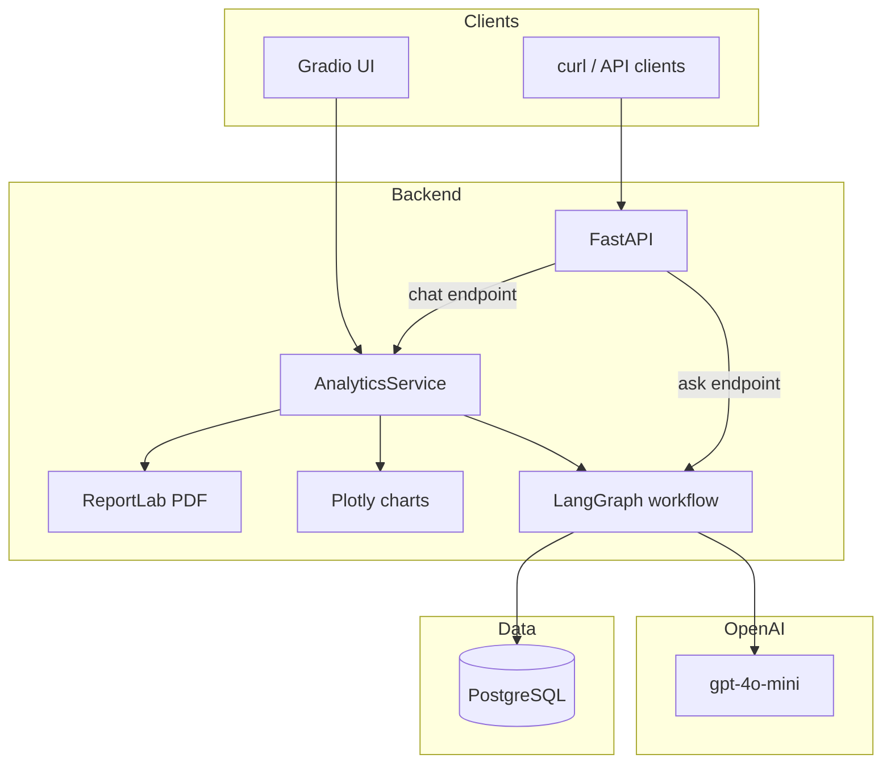
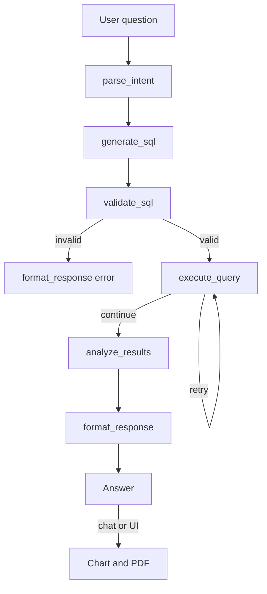

# My Cafe Chain — AI Data Analyst

AI-powered analytics assistant that turns **plain-English questions** into **safe SQL**, runs them on café business data, and returns **insights**, **charts**, and **PDF reports**.

It combines LangGraph orchestration, OpenAI (intent → SQL → analysis), SQL safety validation, Postgres execution, and a Gradio chat UI.

---

## Table of Contents

- [Overview](#overview)
- [Features](#features)
- [Architecture](#architecture)
- [Tech Stack](#tech-stack)
- [Project Structure](#project-structure)
- [Quick Start](#quick-start)
- [Web UI](#web-ui)
- [How a Question Is Answered](#how-a-question-is-answered)
- [SQL Safety Layer](#sql-safety-layer)
- [Chat Layer (Charts + PDF)](#chat-layer-charts--pdf)
- [API Reference](#api-reference)
- [Database Schema](#database-schema)
- [Environment Variables](#environment-variables)
- [Design Decisions](#design-decisions)
- [What Is NOT Built](#what-is-not-built)
- [Troubleshooting](#troubleshooting)
- [LangSmith (optional)](#langsmith-optional)

---


## Overview

This app sits between a **business user** and a **Postgres database** of café-chain data (orders, cafes, vendors). Instead of writing SQL by hand, the user asks questions in everyday language. The system:

1. **Parses** the question into structured intent (OpenAI)
2. **Generates** a SELECT query from that intent (OpenAI)
3. **Validates** the SQL (SELECT-only, allowed tables, LIMIT)
4. **Executes** the query on Postgres (with retries)
5. **Explains** the results in plain language (OpenAI)
6. **(Chat / UI)** Builds a chart and a PDF report on top

Delivery of answers is live via FastAPI + Gradio. Charts are Plotly; PDFs are generated in memory (base64), not stored on disk.

---


## Features

- Natural language → SQL → insights pipeline (LangGraph)
- SQL safety: SELECT only, approved tables, forced `LIMIT 100`
- Automatic retry when query execution fails (up to 2 retries)
- Cafe / vendor **name enrichment** when results only return IDs
- Chat API with conversation memory for follow-ups
- Automatic chart selection (line / bar / scatter / table)
- PDF report generation (summary + chart image)
- Gradio web UI at `/ui` with suggestion prompts
- Optional LangSmith tracing via `LANGCHAIN_*` env vars

---


## Architecture


### System overview




### LangGraph decision pipeline




### Docker services


| Compose file                | Services    | Notes                                               |
| --------------------------- | ----------- | --------------------------------------------------- |
| `docker-compose.local.yaml` | `app`, `db` | Dev: bind-mounts `./app`, Postgres on host **5432** |
| `docker-compose.main.yaml`  | `app`, `db` | Deploy-style: Postgres not exposed on host          |


| Service | Port              | Role                           |
| ------- | ----------------- | ------------------------------ |
| `app`   | 8000              | FastAPI + Gradio (`/ui`)       |
| `db`    | 5432 (local only) | Postgres with café sample data |


---


## Tech Stack


| Layer              | Technology                        |
| ------------------ | --------------------------------- |
| API                | FastAPI, Pydantic, Uvicorn        |
| Orchestration      | LangGraph                         |
| LLM                | OpenAI (`gpt-4o-mini` by default) |
| Database           | PostgreSQL 15 + SQLAlchemy        |
| Charts             | Plotly (+ Kaleido for PDF images) |
| Reports            | ReportLab                         |
| UI                 | Gradio 5 (mounted at `/ui`)       |
| Tracing (optional) | LangSmith via `LANGCHAIN_*`       |
| Infra              | Docker Compose                    |


---


## Project Structure

```text
ai_data_analyst/
├── docker-compose.local.yaml   # Local: app + db, bind-mount, Postgres :5432
├── docker-compose.main.yaml    # Deploy-style: app + db
├── Dockerfile
├── requirements.txt
├── .example.env
├── database_setup.sql          # Schema + sample cafés / vendors / orders
├── run.py                      # Local entry (uvicorn + reload)
├── visualize_graph.py          # Optional graph visualization helper
├── app/
│   ├── main.py                 # FastAPI entry, mounts Gradio
│   ├── config.py               # Environment config
│   ├── api/
│   │   └── chat_routes.py      # POST /chat
│   ├── services/
│   │   └── analytics_service.py  # Chat: graph + charts + PDF
│   ├── graph/
│   │   ├── builder.py          # LangGraph workflow
│   │   └── state.py            # Shared AnalystState
│   ├── nodes/
│   │   ├── intent_parser.py
│   │   ├── sql_generator.py
│   │   ├── sql_validator.py
│   │   ├── execute_query.py
│   │   ├── result_analyzer.py
│   │   └── formatter.py
│   ├── llm/
│   │   ├── client.py
│   │   └── prompts.py
│   ├── database/
│   │   ├── connection.py
│   │   └── result_enrichment.py  # cafe_name / vendor_name lookup
│   ├── chat/
│   │   └── conversation_manager.py
│   ├── visualization/
│   │   ├── visualization_service.py
│   │   ├── chart_selector.py
│   │   └── chart_generator.py
│   ├── reports/
│   │   └── report_generator.py
│   └── ui/
│       └── gradio_app.py       # Web UI
└── docs/
    └── sql_generator_cleaning.txt
```

---


## Quick Start

**Prerequisites:** [Docker Desktop](https://www.docker.com/products/docker-desktop/) (or Docker Engine + Compose), and an OpenAI API key.

### 1. Configure environment

```bash
cp .example.env .env
```

Fill in at least:

```env
OPENAI_API_KEY=your_key_here
OPENAI_MODEL=gpt-4o-mini

POSTGRES_USER=postgres
POSTGRES_PASSWORD=yourpassword
POSTGRES_DB=ai_data_analyst

# Inside Docker Compose, host must be `db`
DATABASE_URL=postgresql://postgres:yourpassword@db:5432/ai_data_analyst

BASE_URL=http://localhost:8000
PORT=8000
```


### 2. Start services (local)

```bash
docker compose -f docker-compose.local.yaml up --build
```


### 3. Seed the database (first run only)

```bash
docker compose -f docker-compose.local.yaml exec -T db \
  psql -U postgres -d ai_data_analyst < database_setup.sql
```

Change `-U` / `-d` if your `.env` uses different Postgres values.

### 4. Verify


| URL                                                          | What           |
| ------------------------------------------------------------ | -------------- |
| [http://localhost:8000/ui](http://localhost:8000/ui)         | Gradio chat UI |
| [http://localhost:8000/](http://localhost:8000/)             | API root       |
| [http://localhost:8000/health](http://localhost:8000/health) | Health check   |


### 5. Optional — run without Docker

```bash
pip install -r requirements.txt
# Point DATABASE_URL at localhost Postgres, then:
psql -U your_user -d your_database -f database_setup.sql
python run.py
```

Run commands from the **project root** (the folder that contains the `app` package).

---


## Web UI

Gradio interface mounted at `/ui`:


| Area   | Contents                                          |
| ------ | ------------------------------------------------- |
| Header | Brand + short “what this is” strip                |
| Left   | Conversation, suggestion chips, message box, Send |
| Right  | Chart + PDF download                              |


Suggestion chips (click to send immediately):

- Last four months order sales graph  
- Cafe-wise sales breakdown  
- Top vendors by orders

When the UI is served from `app.main`, chat runs **in-process** through `AnalyticsService` (same path as `POST /chat`), so you do not depend on `BASE_URL` for Gradio → API HTTP calls.

```bash
# Included when you start compose
docker compose -f docker-compose.local.yaml up --build
# Then open http://localhost:8000/ui
```

---


## How a Question Is Answered


### Path A — `POST /ask` (graph only)

Runs the LangGraph pipeline and returns text + SQL. No chart or PDF.

### Path B — `POST /chat` or Gradio UI

1. Optional small-talk short-circuit (hi / thanks)
2. Attach recent conversation context
3. Run the same LangGraph pipeline
4. Build a chart from `query_result`
5. Generate a PDF (insights + chart image)
6. Store the turn in conversation memory


### Graph steps (shared)


| Step | Node              | What it does                               |
| ---- | ----------------- | ------------------------------------------ |
| 1    | `parse_intent`    | LLM → structured intent JSON               |
| 2    | `generate_sql`    | LLM → SELECT SQL from intent + schema      |
| 3    | `validate_sql`    | Safety checks; force `LIMIT 100`           |
| 4    | `execute_query`   | Run SQL; enrich IDs with cafe/vendor names |
| 5    | `analyze_results` | LLM → business-facing insights             |
| 6    | `format_response` | Final assistant message                    |


On execution errors, the graph may **retry** execute up to 2 times before continuing to analysis / error formatting.

---


## SQL Safety Layer

Implemented in `app/nodes/sql_validator.py`:


| Rule               | Behavior                                               |
| ------------------ | ------------------------------------------------------ |
| Statement type     | Must start with `SELECT`                               |
| Forbidden keywords | Blocks `DELETE`, `DROP`, `INSERT`, `UPDATE`, DDL, etc. |
| Allowed tables     | Only `orders`, `cafes`, `vendors`                      |
| Result size        | Injects / rewrites to `LIMIT 100`                      |


If validation fails, the graph skips execution and returns an error-shaped response.

---


## Chat Layer (Charts + PDF)

Built on top of the graph in `AnalyticsService`:


| Piece               | Module                    | Behavior                                                                      |
| ------------------- | ------------------------- | ----------------------------------------------------------------------------- |
| Conversation memory | `conversation_manager.py` | Last few turns as text context (in-memory)                                    |
| Chart selection     | `chart_selector.py`       | Heuristics: time → line, category → bar, ranking → horizontal bar, else table |
| Chart render        | `chart_generator.py`      | Plotly JSON for the UI                                                        |
| PDF                 | `report_generator.py`     | In-memory PDF; returned as `report_pdf_base64`                                |
| Name enrichment     | `result_enrichment.py`    | Adds `cafe_name` / `vendor_name` when only IDs are present                    |


---


## API Reference


| Method | Path      | Description                          |
| ------ | --------- | ------------------------------------ |
| `GET`  | `/`       | App metadata                         |
| `GET`  | `/health` | Health check                         |
| `POST` | `/ask`    | One-shot question (graph only)       |
| `POST` | `/chat`   | Chat analytics (graph + chart + PDF) |
| `GET`  | `/ui`     | Gradio web UI                        |


### `POST /ask`

```bash
curl -X POST http://localhost:8000/ask \
  -H "Content-Type: application/json" \
  -d '{"question": "What is total revenue by cafe?"}'
```

```json
{
  "answer": "Based on the query results...",
  "sql_query": "SELECT ... LIMIT 100",
  "error": null
}
```


### `POST /chat`

```bash
curl -X POST http://localhost:8000/chat \
  -H "Content-Type: application/json" \
  -d '{
    "conversation_id": "demo-1",
    "query": "Cafe-wise sales breakdown"
  }'
```

```json
{
  "message": "...",
  "sql_query": "SELECT ...",
  "chart": { },
  "report_pdf_base64": "JVBERi0x..."
}
```

---


## Database Schema

Created by `database_setup.sql`:

```sql
cafes    — id, name, location, manager_name, created_at
vendors  — id, name, category, contact_email, created_at
orders   — id, cafe_id, vendor_id, order_date, total_amount, status, items (JSONB), created_at
```

Sample data includes multiple cafés, suppliers, and orders over recent months — enough to demo trends, breakdowns, and rankings.

---


## Environment Variables

Copy the template:

```bash
cp .example.env .env
```


| Variable             | Description                                                   |
| -------------------- | ------------------------------------------------------------- |
| `OPENAI_API_KEY`     | Required for intent, SQL, and insights                        |
| `OPENAI_MODEL`       | Default `gpt-4o-mini`                                         |
| `DATABASE_URL`       | SQLAlchemy Postgres URL (`db` as host in Docker)              |
| `POSTGRES_USER`      | Postgres user for the `db` service                            |
| `POSTGRES_PASSWORD`  | Postgres password                                             |
| `POSTGRES_DB`        | Database name                                                 |
| `BASE_URL`           | Public base URL of this API (default `http://localhost:8000`) |
| `PORT`               | Uvicorn listen port (default `8000`)                          |
| `LANGCHAIN_TRACING`  | `true` to enable LangSmith                                    |
| `LANGCHAIN_API_KEY`  | LangSmith API key                                             |
| `LANGCHAIN_PROJECT`  | LangSmith project name                                        |
| `LANGCHAIN_ENDPOINT` | Optional LangSmith endpoint                                   |
| `LOG_LEVEL`          | Optional; default `INFO`                                      |


LangSmith uses the `LANGCHAIN_*` names (LangChain convention), not `LANGSMITH_*`.

---


## Design Decisions

**LangGraph for the analyst core** — Intent, SQL, validation, execution, and analysis are separate nodes with clear state. Retries and validation branches stay explicit.

**Chat wraps the graph (does not fork it)** — `AnalyticsService` calls the same compiled graph as `/ask`, then adds charts and PDFs. The SQL pipeline stays one path.

**SQL validation before execute** — Deterministic guards run before touching the database. No DML/DDL on the analyst path.

**Name enrichment after query** — Many generated queries return `cafe_id` / `vendor_id`. A small post-step adds human names so insights and charts stay readable.

**In-memory conversation** — Simple and enough for demos. Not shared across processes or restarts; production would use Redis or a DB.

**Gradio in-process chat** — When mounted from `main.py`, the UI calls `AnalyticsService` directly so Docker `BASE_URL` misconfig does not silently skip the pipeline.

**Simulated café domain** — Focus is the NL→SQL→insights product loop, not a real multi-tenant warehouse.

---


## What Is NOT Built

- Authentication or multi-tenant access control  
- Persistent conversation store (memory is process-local)  
- Writing to the database from the assistant (read-only SELECT)  
- Real-time streaming of LLM tokens in the UI  
- Dedicated vector DB / RAG over documents (schema is prompt-driven)  
- Production chart hosting or PDF file storage (PDF is returned as base64)

---


## Troubleshooting


### UI loads but no graph / node logs

Confirm the app is running the latest `app/main.py` (Gradio injects `AnalyticsService`). Watch logs with:

```bash
docker compose -f docker-compose.local.yaml logs -f app
```

You should see lines like `[gradio] in-process chat` and `[parse_intent]` after sending a message.

### `WatchFiles detected changes` / constant reloads

`--reload` was removed from the Docker `CMD` because bind-mounting `./app` caused restarts on every save. Restart the container after code changes, or run uvicorn with `--reload` on the host.

### Database connection errors

1. Check `DATABASE_URL` uses host `db` inside Compose
2. Confirm Postgres env vars match the URL
3. Wait until `db` is healthy, then re-run `database_setup.sql` if tables are missing


### Empty or “couldn’t process” answers

1. Set a valid `OPENAI_API_KEY`
2. Seed sample data with `database_setup.sql`
3. Ask something in scope (sales, cafes, vendors)


### `ModuleNotFoundError: No module named 'app'`

Run from the project root (directory that contains the `app` package).

### Reset local Postgres volume

```bash
docker compose -f docker-compose.local.yaml down -v
docker compose -f docker-compose.local.yaml up --build
docker compose -f docker-compose.local.yaml exec -T db \
  psql -U postgres -d ai_data_analyst < database_setup.sql
```


### Deploy-style Compose

```bash
docker compose -f docker-compose.main.yaml up -d --build
docker compose -f docker-compose.main.yaml exec -T db \
  psql -U postgres -d ai_data_analyst < database_setup.sql
```

---


## LangSmith (optional)

Useful when debugging LangGraph / LLM steps.

1. Create a key at [LangSmith](https://smith.langchain.com)
2. In `.env`:

```env
LANGCHAIN_TRACING=true
LANGCHAIN_API_KEY=your_api_key_here
LANGCHAIN_PROJECT=ai_data_analyst
```

1. Restart the app and open the LangSmith dashboard.

---


## License

Update as needed for your repository.